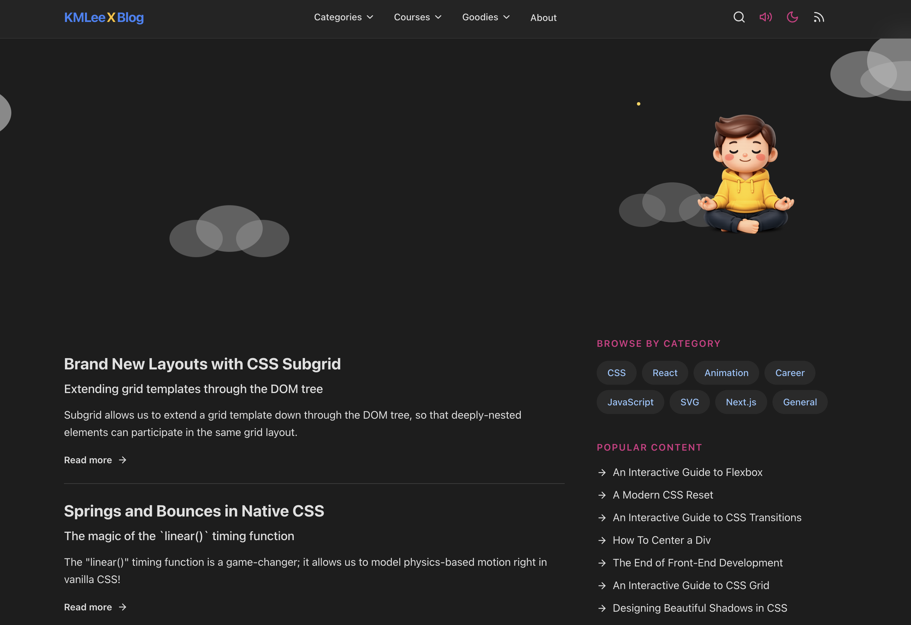

# KMLeeX Blog

A personal blog built with Next.js 15, featuring articles about CSS, React, Animation, SVG, Next.js, Career, and Web Development.

## 

## Features

- **Search** - Real-time search with 300ms debounce across article titles, descriptions, subtitles, categories, and content
- **Pagination** - Articles are paginated with 6 articles per page
- **Back to Top** - Smooth scroll back to top button
- **Table of Contents** - Auto-generated TOC for articles (fixed position on desktop)
- **Dark Mode** - Toggle between light and dark themes with localStorage persistence and anti-flicker
- **Responsive Design** - Mobile-friendly with hamburger menu navigation
- **Category Filtering** - Browse articles by category (CSS, React, Animation, Career, JavaScript, SVG, Next.js, General)
- **Syntax Highlighting** - Code blocks with syntax highlighting
- **Article View Counts** - Tracks and displays view counts for articles
- **Sound Effects** - Optional UI sounds (hover, click, success, notification) using Web Audio API
- **Cloud Background** - Dynamic cloud background animation
- **Framer Motion Animations** - Page transitions and UI animations

## Tech Stack

- **Next.js 15.5** - App Router, Static Site Generation
- **React 18** - UI framework
- **Tailwind CSS** - Styling
- **Framer Motion** - Animations
- **Lucide React** - Icons
- **React Markdown** - Markdown rendering
- **React Syntax Highlighter** - Code syntax highlighting
- **Sharp** - Image optimization

## Getting Started

```bash
# Install dependencies
npm install

# Start development server
npm run dev

# Build for production
npm run build

# Start production server
npm start

# Start production with custom port
npm start -- -p 3000

# Start in background mode with custom port
./start.sh -b -p 3000

# Lint code
npm run lint
```

## Project Structure

```
app/
├── [slug]/page.tsx         # Article detail page
├── category/[category]/    # Category pages
├── about/page.tsx          # About page
├── api/views/               # API route for view counts
├── components/              # Reusable UI components
│   ├── ArticleCard.tsx
│   ├── ArticleContent.tsx
│   ├── ArticleNavbar.tsx
│   ├── BackToTop.tsx
│   ├── CategoryTags.tsx
│   ├── CloudBackground.tsx / CloudBackgroundClient.tsx
│   ├── CodeHighlighter.tsx
│   ├── Logo.tsx
│   ├── PageMotion.tsx
│   ├── Pagination.tsx
│   ├── PopularContent.tsx
│   ├── SearchModal.tsx
│   ├── TableOfContents.tsx
│   ├── ToolButtons.tsx
│   └── ViewCount.tsx
├── context/                 # React Context (theme, sound)
├── data/articles/           # Article content (markdown files)
│   ├── articles.ts          # Article metadata and helpers
│   ├── content.ts           # Article content imports
│   └── *.md                 # Individual article files
├── sections/                # Page sections
│   ├── ArticleList.tsx
│   ├── Footer.tsx
│   ├── Hero.tsx / HeroImage.tsx
│   ├── Navbar.tsx
│   └── Sidebar.tsx
└── lib/                     # Utilities and constants
    ├── constants.ts
    └── utils.ts
data/
└── views.json               # Article view counts storage
```

## Adding New Articles

1. Create a markdown file in `app/data/articles/` (e.g., `my-article.md`)
2. Import and export the file in `app/data/articles/content.ts`
3. Add article metadata to `app/data/articles.ts`

## License

MIT
